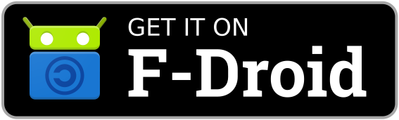
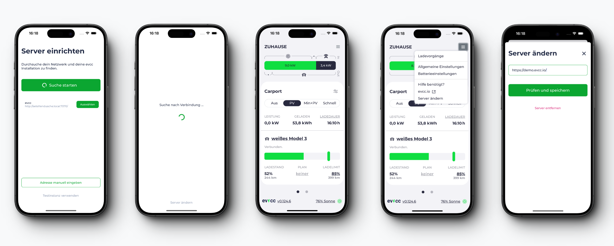

# evcc Companion App

Native app wrapper for evcc UI based on [react-native](https://reactnative.dev/) and [expo.dev](https://expo.dev/). It uses [UI Kitten / Eva](https://akveo.github.io/react-native-ui-kitten/) as a design system. Native parts are written in TypeScript and kept to a minimum.

## Download the App

| Apple                                                                                                                                                                             | Android                                                                                                                                                                              |
| :-------------------------------------------------------------------------------------------------------------------------------------------------------------------------------- | :----------------------------------------------------------------------------------------------------------------------------------------------------------------------------------- |
| [](https://apps.apple.com/app/evcc-io/id6478510176)     | [](https://play.google.com/store/apps/details?id=io.evcc.android) |
| [](https://apps.apple.com/app/evcc-io/id6478510176) | [](https://f-droid.org/packages/io.evcc.android)                           |
|                                                                                                                                                                                   | [](https://github.com/evcc-io/app/releases/latest)                       |

## Beta Testing

- Apple Testflight https://testflight.apple.com/join/8Y4elMpv
- Android: Download the APK from [GitHub Releases](https://github.com/evcc-io/app/releases)

## Features

- Onboarding
  - find evcc instances in local network via mDNS
  - add instance manually via URL
  - custom url scheme to improve setup (see [here](#url-scheme))
  - try the app using the demo instance
- Full screen evcc UI
  - use the app in a full screen web view
  - UI runs in an optimized mode that respects insets (notch, ...)
  - better gesture support (swipe, ...) by disabling browser zoom and overscroll
- Online/offline detection
  - app shows loading screen when instance is not reachable
  - automatic reconnection when instance becomes reachable again
  - avoids missleading situations where the app is shown but not functional
- Configured URL can be changed
  - in offline mode
  - via additional top navigation entry "Change server"
- Light and dark mode for native UI
  - based on system settings (not configurable)

## Screenshots



## URL Scheme

The evcc app registers a `evcc://` URL scheme on your device.
This can be helpful to improve the setup process by providing the users with a link or QR code that prefills the server URL and basic auth credentials (optional).
Especially helpful when dealing with longer URLs for public tunnels or related setups.

The app supports the following URL scheme:

**Format:**

Opens the server entry field with prefilled values.
All params are optional.

```
evcc://server?url=...&username=...&password=...
```

_Note: Ensure that query values are properly encoded._

**Example:**


[evcc://server?url=https://evcc.local&username=admin&password=secret](evcc://server?url=https://evcc.local&username=admin&password=secret)

## Known limitations

- No support for multiple instances [#3](https://github.com/evcc-io/app/issues/3)

We'll work on these in a future release. Feel free to vote 👍 to help priorization and add new feature ideas.

## Development

Ensure that you've Node.js and NPM installed. Then install the dependencies:

```bash
npm install
```

Follow the expo instructions to run local simulators for [iOS](https://docs.expo.dev/workflow/ios-simulator/) and [Android](https://docs.expo.dev/workflow/android-studio-emulator/).

Start dev mode to get into an interactive development environment.

```bash
npm run start
```

Or start iOS, Android or Web simulator directly.

```bash
npm run ios
npm run android
npm run web
```

You can test basic auth locally by with a [caddy server](https://caddyserver.com):

```bash
caddy run
```

It will open a server on http://localhost:7080 with `admin:secret` as basic auth credentials and forward requests to your local evcc instance 7070.

## Build Android APK without EAS

This is how F-Droid builds the APK:

```bash
npx expo prebuild --platform android --clean
cd android/app
sed -i -e '/signingConfig /d' build.gradle
./../gradlew assembleRelease
```

## Testing

If you have never tested the app locally on your computer before, follow the instructions below and make sure that `evcc` runs and the app tests successfully. If you encounter any errors, feel free to create an issue.

Once you have successfully tested the app, from now on it will be sufficient to ensure `evcc` runs and simply execute the `npm run test:XXX` command.

### Prerequisites:

#### 1. Install and start `caddy`:

- Linux & macOS:

  ```bash
  curl -sS https://webi.sh/caddy | sh
  ```

- Windows:

  ```bash
  curl.exe https://webi.ms/caddy | powershell
  ```

#### 2. Install and start `evcc`:

- Linux:
  ```bash
  curl -1sLf 'https://dl.evcc.io/public/evcc/stable/setup.deb.sh' | sudo -E bash
  sudo apt update
  sudo apt install -y evcc
  sudo systemctl start evcc
  ```
- macOS:
  ```bash
  brew tap evcc-io/tap
  brew update
  brew install evcc
  brew services start evcc
  ```
- Windows: [See instructions](https://docs.evcc.io/en/docs/installation/windows#installation)

### Testing Android app _(available on Linux, macOS and Windows)_

#### Emulator (slower):

1. Ensure you have installed [Android Studio](https://developer.android.com/studio).
2. Create a virtual device:
   ```bash
   avdmanager create avd -n test -k "system-images;android-36;google_apis_playstore;x86_64" -d "medium_phone"
   ```
3. Prebuild the app:
   ```bash
   npx expo prebuild --platform android
   ```
4. Build and test the app:
   ```bash
   npm run test:android:emulator
   ```

#### Attached device (faster):

1. [Enable Developer options](https://developer.android.com/studio/debug/dev-options#enable) on your device.
2. [Enable debugging](https://developer.android.com/studio/debug/dev-options#Enable-debugging) on your device and ensure you have connected your device to your computer.
3. Prebuild the app:
   ```bash
   npx expo prebuild --platform android
   ```
4. Build and test the app:
   ```bash
   npm run test:android:attached
   ```

### Testing iOS app _(only available on macOS)_

#### Emulator:

1. [Set up Xcode and Watchman](https://docs.expo.dev/get-started/set-up-your-environment/?platform=ios&device=simulated&mode=development-build&buildEnv=local)
2. Install `applesimutils`
   ```bash
   brew tap wix/brew
   brew install applesimutils
   ```
3. Prebuild the app:
   ```bash
   npx expo prebuild --platform ios
   ```
4. Build and test the app:
   ```bash
   npm run test:ios
   ```

## Translation

We use [Weblate](https://hosted.weblate.org/projects/evcc/app/) to manage our translations.

[](https://hosted.weblate.org/engage/evcc/)
